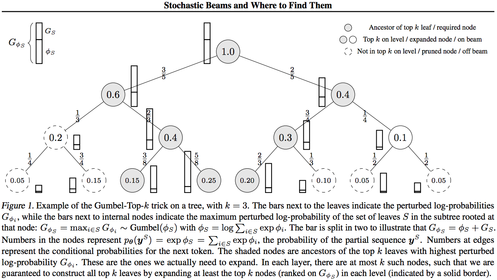

# Stochastic Beam Search

This is an implementation of Stochastic Beam Search, a stochastic variant of beam search that draws samples *without* replacement from a sequence model.

### For details, see our [ICML 2019](https://icml.cc/) paper:

[Stochastic Beams and Where To Find Them](https://arxiv.org/abs/1903.06059): The Gumbel-Top-k trick for Sampling Sequences Without Replacement.



### Summary
We can draw k samples *without replacement* from a categorical distribution by adding independent Gumbel noise to the log-probabilities and taking the top k largest of the *perturbed log-probabilities*. This can be seen as an extension of the Gumbel-Max trick (for which k = 1) and as a partial ranking according to the Plackett-Luce model.

For a sequence model, we cannot add Gumbel noise to the log-probabilities for all sequences in the exponentially large domain, but we can use a stochastic variant of Beam Search to find the top k sequences, *without* instantiating the complete domain.

Stochastic Beam Search makes use of the factorized structure of the sequence model to sample the Gumbel noise in a top down manner, and only extends the k partial sequences that can possibly be extended to a top k completed sequence.

For more details, [see the paper](https://arxiv.org/abs/1903.06059).

### Usage instructions
For installation instructions and basic fairseq usage instruction, please go to [the fairseq repository](https://github.com/pytorch/fairseq).
To use Stochastic Beam Search for generation:
- Add the ``--stochastic-beam-search`` option and use the (normal) ``--beam`` option with ``generate.py``
- Set the ``--nbest`` option equal to ``--beam`` (using a beam size greater than nbest is equivalent)
- For theoretical correctness of the sampling algorithm, you cannot use heuristic beam search modifications such as length normalization and early stopping. Therefore run *with* ``--no-early-stopping`` and ``--unnormalized``
- Use the ``--sampling_temperature`` option to specify the temperature used for (local) softmax normalization. For models trained using maximum likelihood, the default temperature of 1.0 does not yield good translations, so use a lower temperature.
- Example: ``python generate.py --stochastic-beam-search --beam 5 --nbest 5 --no-early-stopping --unnormalized --sampling_temperature 0.3 ...``

### Note
As the beam search implementation in fairseq is a bit complicated (see also [here](https://github.com/pytorch/fairseq/issues/535)), this implementation of Stochastic Beam Search has some rough edges and is not guaranteed to be compatibel with all fairseq generation parameters.
The code is not specifically optimized for memory usage etc.

If you have any comments or suggestions, please create an issue or contact me (e-mail address in the paper). If you use Stochastic Beam Search, we would be happy if you cite our paper: 
```
@inproceedings{kool2019stochastic,
  title={Stochastic Beams and Where to Find Them: The Gumbel-Top-k Trick for Sampling Sequences Without Replacement},
  author={Wouter Kool and Herke van Hoof and Max Welling},
  booktitle={International Conference on Machine Learning},
  year={2019}
}
```